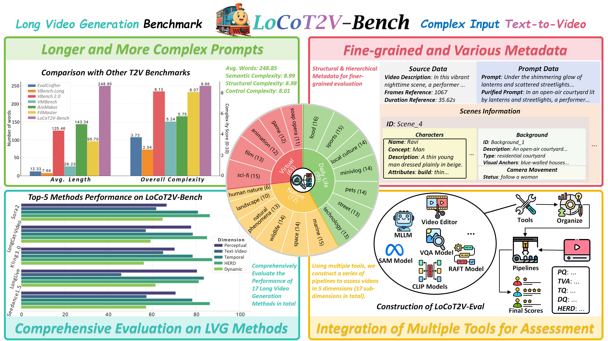

# LoCoT2V-Bench: Benchmarking Long-Form and Complex Text-to-Video Generation
[](https://arxiv.org/abs/2510.26412)

Official implementation of **LoCoT2V-Bench: Benchmarking Long-Form and Complex Text-to-Video Generation** (ICML 2026)

If you have any questions, feel free to contact us with this Email: [xiangqingzheng0702@gmail.com](xiangqingzheng0702@gmail.com)



## :calendar: TODOs
> - [x] release the prompt data and metadata for evaluation
> - [ ] release the source videos (will be a link to download these videos)
> - [x] release evaluation code
> - [x] release the final version paper on arxiv


## :blue_book: Summary
LoCoT2V-Bench is a comprehensive evaluation benchmark designed to assess long-form text-to-video generation under complex, multi-scene textual conditions. Grounded in high-quality real-world videos, the benchmark provides detailed, script-level prompts enriched with hierarchical metadata, including specific character attributes and camera movements. To systematically measure generation quality, we introduce LoCoT2V-Eval, a multi-dimensional evaluation framework that assesses fine-grained text-video alignment through a hierarchical tree-structured VQA approach and captures high-level narrative fulfillment via a dual-agent Human Expectation Realization Degree (HERD) metric. Extensive evaluations across 17 leading models reveal that while current approaches excel in overall visual quality and background stability, they still face significant challenges in fine-grained semantic adherence and long-term character consistency.


## :package: Project Structure

```text
LoCoT2V-Bench/
├── ckpts/                       # Downloaded model weights (not committed)
├── data/
│   └── prompt.json              # Prompts and evaluation metadata
├── eval_videos/
│   └── example.json             # Example video list
├── environments/                # Conda environment files
├── locot2v_eval/                # Core evaluation package
│   ├── eval_suite/              # Metric scripts
│   ├── modules/                 # Model wrappers
│   └── utils/                   # Utility functions
├── scripts/                     # Helper and batch scripts
├── videos/                      # Put your own videos here
├── LICENSE
└── README.md
```

## :camera: Collected Real-world Videos
We are still uploading these videos to the cloud space, please patiently wait for the release...

## :floppy_disk: Model Checkpoints

All learnable checkpoints are excluded from git. Download them with:

```bash
cd ckpts/
bash ckpts/download.sh
```

However, the checkpoints required to evaluate devil scores should manually download from the urls given by the source repo (Refer to [DEVIL](https://github.com/MingXiangL/DEVIL)).
Specifically, required checkpoints could be downloaded from [Google Drive](https://drive.google.com/drive/folders/1VEMOOOLyw_7fumLpmL5AiMEEok-tZjsD?usp=sharing) or [Baidu Disk(extract code: 2gjp](https://pan.baidu.com/s/1CXwCRRWWvFV-WpZL18ekBQ?pwd=2gjp) and the following models are necessary:
```text
ckpts/
├── devil_weights/
│   ├── dinov2_vitl14_pretrain.pth
│   ├── linear_regress_model.pth
│   ├── ViClip-InternVid-10M-FLT.pth
│   ├── ViT-B-32.pt
│   ├── ViT-B-16.pt
│   └── ViT-L-14.pt
```

Expected layout after downloading:

```text
ckpts/
├── AMT/
│   ├── amt-s.pth
│   └── AMT-S.yaml
├── DeQA-Score-Mix3/
├── Qwen3-VL-4B-Instruct/
├── Qwen3-VL-8B-Instruct/
├── RAFT/
│   ├── raft-chairs.pth
│   ├── raft-things.pth
│   └── ...
├── fg-clip2-base/
├── sam3/
├── devil_weights/
│   ├── dinov2_vitl14_pretrain.pth
│   ├── linear_regress_model.pth
│   ├── ViClip-InternVid-10M-FLT.pth
│   ├── ViT-B-32.pt
│   ├── ViT-B-16.pt
│   └── ViT-L-14.pt
└── dq_linear_regression_models/
    ├── dq_linear_model.pkl
    └── dq_scaler.pkl
```

> **Note:** `ckpts/download.sh` should be executed from the repository root. Some URLs in the script are external mirrors and may change over time. If a download fails, please manually place the corresponding file in the expected subdirectory.

## :wrench: Environment Setting

Different metrics rely on different package versions, so we provide four conda environments:

```bash
conda env create -f environments/environment_locot2v_bench.yml
conda env create -f environments/environment_vbench.yml
conda env create -f environments/environment_sam3.yml
conda env create -f environments/environment_pq.yml
```

Each per-metric script already calls the correct environment via `conda activate`, the mapping between different evaluation environments and metrics are as follows:

| Metric | Script | Environment |
|---|---|---|
| Perceptual Quality | `scripts/eval_perceptual_quality.sh` | `pq_eval` |
| Overall Alignment | `scripts/eval_overall_alignment.sh` | `locot2v_bench` |
| Fine-Grained Alignment | `scripts/eval_fine_grained_alignment.sh` | `locot2v_bench` |
| Character Consistency | `scripts/eval_character_consistency.sh` | `sam3_env` |
| Background Consistency | `scripts/eval_background_consistency.sh` | `locot2v_bench` |
| Warping Error | `scripts/eval_warping_error.sh` | `vbench_env` |
| HERD | `scripts/eval_herd.sh` | `locot2v_bench` |
| Dynamic Quality | `scripts/eval_dynamic_quality.sh` | `vbench_env` + `locot2v_bench` |

## :clipboard: Detailed Metadata Fields

For each theme and sample id, `data/prompt.json` contains the following fields:

- `source_description`: A detailed natural-language description of the source real-world video.
- `frame_num_ref`: The number of frames in the source video.
- `duration_ref`: The duration of the source video in seconds.
- `prompt`: The text prompt used to generate evaluation videos.
- `purified_prompt`: The prompt with named entities replaced by concrete visual descriptions. This version is used for MLLM-based overall alignment scoring because general MLLMs do not know specific character names.
- `character_infos`: Per-character metadata required by the Character Consistency metric.
  - `concept`: General category of the character (e.g., woman, dog).
  - `description`: Detailed visual description of the character.
  - `attributes`: Finer-grained attributes used in Fine-Grained Alignment Evaluation.
  - `sam_prompt`: A simplified description used by SAM3 for segmentation.
- `background_infos`: Scene-level background descriptions and constraints.
- `scene_infos`: Structured scene-level information, such as locations and temporal order.
- `fga_questions`: Hierarchical tree-structured VQA questions used by the Fine-Grained Alignment metric.
- `herd_expectations`: Human expectations across six narrative dimensions used by the HERD metric.
- `herd_questions`: Auxiliary questions optionally used by the HERD evaluator.

## :rocket: Evaluation Guidance
Ensure to run these commands or scripts from the project root directory to avoid path issues.

### 1. Prepare the video list

Place your videos under `videos/` and generate an evaluation JSON:

```bash
python scripts/make_eval_list.py \
    --video_dir ./videos \
    --output_json ./eval_videos/my_videos.json
```

The generated JSON maps each sample id to the corresponding video path.

### 2. Run a single metric

```bash
bash scripts/eval_overall_alignment.sh "./eval_videos/my_videos.json" "./results/my_videos/"
```

Replace `eval_overall_alignment.sh` with any other script in `scripts/` for the metric you want to compute.

### 3. Run all metrics

Edit the variables at the top of `scripts/eval_all_metrics.sh` and run:

```bash
bash scripts/eval_all_metrics.sh
```

This will generate the video list, run every metric, and save results under the specified result directory.

### (Optional) 4. Run evaluation perspectively
Of course, we also support the practice of evaluating on these metrics respectively, which is more recommended because of higher efficiency (You may run different evaluation on different GPUs for parallelization).
For example, you could run one of the evaluation scripts like this for only assessing perceptual quality:

```bash
bash scripts/eval_perceptual_quality.sh \
    --eval_data "./eval_videos/example.json" \
    --result_path "./results/example/eval_perceptual_quality.json"
```

> **Note:** The DQ score is derived from the Dynamic Degree, Motion Smoothness, and Devil Scores. After these three metrics finish
**python scripts/compute_dq_scores.py $RESULT_DIR** will be used to obtain the merged score that reported in our paper.
This produces `eval_dq_scores.json` in the same directory, containing both per-sample and overall DQ scores.

## :page_facing_up: Results

Each metric writes a JSON file with the following structure (actual format may vary among the results from different metrics):

```json
{
    "overall_score": 0.8234,
    "sample_scores": {
        "film_1": 0.9123,
        "film_15": 0.7345,
        ...
    }
}
```

Metrics with multiple sub-dimensions (e.g., HERD, Fine-Grained Alignment, Devil Scores) additionally include per-dimension scores inside each sample and corresponding `overall_*` fields.

## :warning: Notes and Common Issues

- The evaluation code is developed and tested on **Linux with NVIDIA GPUs**.
- `scripts/eval_*.sh` use `conda activate`. If you see `conda: command not found` or activation fails, initialize conda for your shell first.
- `eval_dynamic_degree.py` and `eval_motion_smoothness.py` import from the `vbench` Python package, which is installed in `vbench_env`.
- `eval_character_consistency.py` requires a SAM3-compatible `transformers` installation; use the `sam3_env` environment.
- `eval_devil_scores.py` invokes a bash script for temporal entropy computation and requires `ffmpeg` and `bc` to be available.
- `eval_warping_error.py` relies on a local RAFT implementation. Ensure the corresponding third-party code is present under `locot2v_eval/utils/third_party/`.
- The Dynamic Quality metric internally switches between `vbench_env` and `locot2v_bench`; running it inside an already activated conda environment is fine, but non-interactive shells may need the conda initialization step mentioned above.

## :pray: Acknowledgments
This project is built upon or has drawn inspiration from several excellent open-source projects and models. We deeply appreciate their contributions to the community:
- **[VBench](https://github.com/Vchitect/VBench)**: We utilize their implementations and convert them into streaming version for assessing Dynamic Degree and Motion Smoothness.
- **[EvalCrafter](https://github.com/evalcrafter/EvalCrafter)**: We incorporate their implementation for calculating Warping Error (located in our `third_party` directory).
- **[DEVIL](https://github.com/MingXiangL/DEVIL)**: We adapt their pipeline and model weights for DEVIL score evaluation.
- **[RAFT](https://github.com/princeton-vl/RAFT)**: Mainly used in metrics like warping error, devil scores and so on.
- **[DeQA-Score](https://github.com/zhiyuanyou/DeQA-Score)**: We employ their model for frame-level perceptual quality evaluation.
- **[SAM3](https://github.com/facebookresearch/sam3)**: Used in our Character Consistency evaluation module.
- **[Qwen3-VL](https://github.com/qwenlm/qwen3-vl)**: We leverage the Qwen3-VL-Instruct series for vision-language alignment evaluation.

## :scroll: License
This project is released under the MIT License. See [LICENSE](./LICENSE) for details.

## :star: Citation
If you find our work helpful for your research, please consider citing our work.
```
@article{zheng2025locot2v,
  title={LoCoT2V-Bench: Benchmarking Long-Form and Complex Text-to-Video Generation},
  author={Zheng, Xiangqing and Wu, Chengyue and Chen, Kehai and Zhang, Min},
  journal={arXiv preprint arXiv:2510.26412},
  year={2025}
}
```
